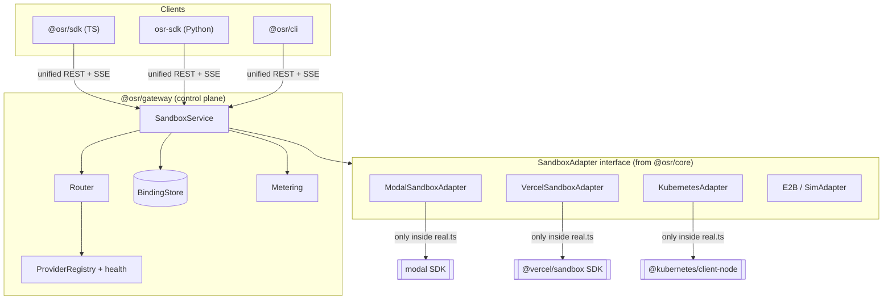
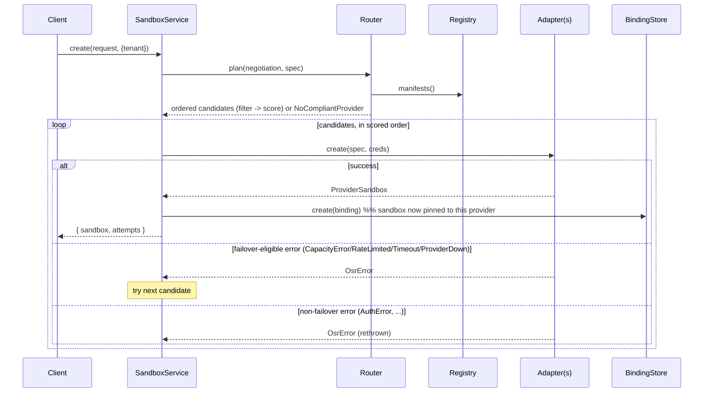
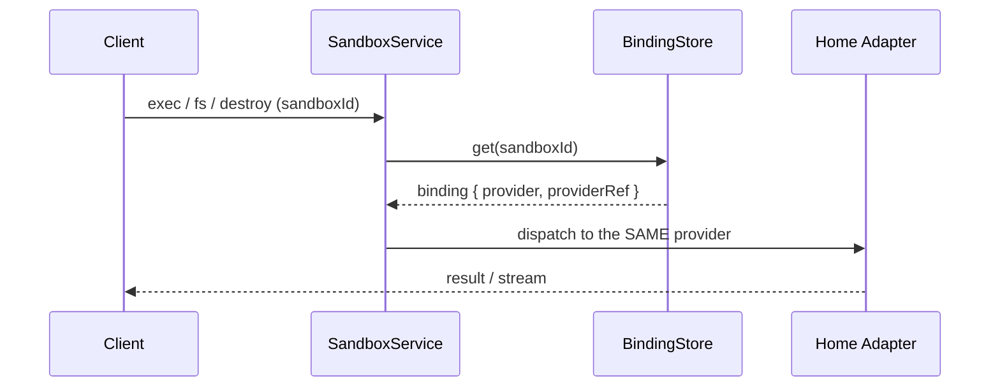

# Architecture

Open Sandbox Router (OSR) is a control plane that makes code-execution sandboxes a
commodity: you write against one interface, and OSR places each workload on the best
provider by cost, latency, capability, and availability — with automatic failover.

This document explains the internal structure. For how to *use* it, see
[`docs/GUIDE.md`](./docs/GUIDE.md). For the full product/technical rationale, see
[`SPEC.md`](./SPEC.md).

## The one idea that shapes everything

A sandbox is a **stateful, long-lived resource**, not an independent request. Once it's
created on a provider, every later operation (`exec`, filesystem, ports) must go back to
that *same* provider. Three consequences:

1. **Routing happens only at `create`.** Afterwards the sandbox is bound to its home
   provider for life (session affinity).
2. **Capability negotiation is first-class.** Providers diverge sharply (snapshots, GPU,
   ports, isolation). A create request declares required capabilities; the router filters
   candidates *before* scoring and fails loud rather than silently degrading.
3. **Failover splits in two.** Create-time failover is cheap and always on. Mid-session
   failover needs snapshot/migration and is opt-in.

## The adapter boundary

The single most important boundary: **the core knows only the `SandboxAdapter`
interface**. Vendor SDKs are imported in exactly one file per provider — that provider's
`real.ts` — and never leak upward.



Everything above the interface line deals purely in normalized types (`Sandbox`,
`ExecEvent`, `CapabilityManifest`, `NormalizedSpec`). That is why the same
`create → exec → destroy` calls run unchanged on Modal, Vercel, or Kubernetes.

## Packages

| Package | Responsibility |
|---|---|
| `@osr/core` | Normalized types, `SandboxAdapter` contract, capability model + negotiation, error taxonomy, **routing engine**, binding store, `SandboxService` |
| `@osr/adapter-sim` | Simulated in-memory runtime + `SimAdapter` base + shared cost helper |
| `@osr/adapter-modal` | Modal adapter (live `modal` SDK, simulated fallback) |
| `@osr/adapter-vercel` | Vercel adapter (live `@vercel/sandbox` SDK, simulated fallback) |
| `@osr/adapter-kubernetes` | Self-hosted adapter — Pod-per-sandbox via `@kubernetes/client-node` |
| `@osr/adapter-e2b` | E2B adapter (manifest/cost; live wiring TODO) |
| `@osr/gateway` | Fastify REST + SSE control plane, config/registry wiring, metering |
| `@osr/sdk` | TypeScript client with an ergonomic `Sandbox` handle |
| `@osr/cli` | `osr` command-line interface |

Each adapter package has an identical shape: `manifest.ts` (capability profile + cost
model), `real.ts` (the vendor-SDK implementation of `SandboxAdapter`), `index.ts`
(factory choosing real vs simulated). A vendor package appearing under an adapter's
`node_modules` (e.g. `@vercel/sandbox`, `modal`) is just its installed, git-ignored
dependency — not OSR code.

## Core types

```
SandboxAdapter        the provider contract every adapter implements
CapabilityManifest    what a provider supports: isolation, features, limits, regions, cost model
NormalizedSpec        a resolved create spec handed to an adapter (provider + region chosen)
Sandbox               provider-neutral view returned to callers
Binding               durable sandboxId -> { provider, providerRef, tenant, ... } record
ExecEvent / CodeEvent normalized streamed output
OsrError              normalized error taxonomy (drives failover decisions)
```

## Request lifecycle

### create — the only routing decision point



### every other op — session affinity



There is no re-routing of an existing sandbox — the binding is authoritative.

## Routing engine

Runs only at create. Pipeline: **filter → score → order → attempt with failover.**

1. **Filter (capability negotiation):** keep providers whose manifest satisfies *all*
   required capabilities and hard policy (allow/deny, region glob, `isolationFloor`,
   resource limits). Empty result → `NoCompliantProvider` with the unmet constraint.
2. **Score:** a weighted sum over normalized factors — cost, cold-start latency, region
   match, reliability (rolling error rate + recent-outage penalty), preferred-capability
   bonus, and explicit provider `order`. Named strategies (`cost`, `latency`, `order`,
   `balanced`, `pin:<provider>`) are presets over these weights.
3. **Guardrails:** providers estimated above `maxCostPerHourUsd` are dropped; recent
   outages are strongly deprioritized.
4. **Failover:** try candidates in scored order; on a failover-eligible `OsrError`, move
   to the next; exhausting the list yields `AllProvidersFailed`.

`pin:<provider>` only replaces step 2 (scoring) with "just use this one" — it still runs
through step 1 first. A pin to a provider that fails negotiation (missing capability,
denied by policy, over budget) throws `NoCompliantProvider` exactly like the unpinned
path. This was a real bug until it wasn't: an earlier version let `pin:` skip negotiation
entirely, which meant pinning could silently hand back a sandbox that didn't meet a
stated requirement, or bypass an admin's `deny` list. Fixed in `Router.plan()` — pin now
resolves the negotiated candidate set first and selects from within it, or fails loud.

### How each behavior is actually verified

Every strategy and guardrail below has a dedicated assertion, not just a demo that prints
output for a human to eyeball. Look here first when changing routing behavior:

| Behavior | Verified in |
|---|---|
| Capability filtering / `NoCompliantProvider` | `packages/core/src/router.test.ts` — `capability negotiation + routing` |
| `cost`, `latency`, `order`, `balanced` (default) strategies | same file — `routing strategies` (the `balanced` test asserts it picks a *different* winner than `cost` on the same fixture, proving it isn't just an alias) |
| `pin:<provider>` — happy path AND still-fails-loud on missing capability / over-budget / denied | same file — `routing strategies` |
| `allow`, `deny`, `region`, `maxCostPerHourUsd`, `allowFallbacks: false` guardrails | same file — `guardrails` |
| Create-time failover (retries on `CapacityError`, does NOT retry on `AuthError`) | same file — `create-time failover` |
| **Session affinity**, in-process | same file — `session affinity`: a sandbox stays bound to its creating provider even after a strictly-better provider registers afterward, proven via a call log shared across fake adapters (every op after `create` is asserted to hit the *same* adapter instance) |
| **Session affinity**, over real HTTP | `packages/gateway/src/server.test.ts` — two sandboxes pinned to two different providers, requests interleaved, each `GET` must return its own sandbox's original provider |
| `exec` streaming (SSE) | same file — parses the actual `text/event-stream` body into events and asserts stdout + a terminal exit event |
| Binding persistence across separate OS processes | `packages/embed/src/file-binding-store.test.ts` — writes with one `FileBindingStore` instance, reads with a fresh one (simulating two separate `osr` CLI invocations) |
| Real provider behavior (Modal, Vercel) | not unit-tested (would require live credentials in CI); verified manually against production APIs — see `examples/live-providers.ts` and the "Try it live" section of `docs/GUIDE.md` |

Run the whole suite with `pnpm test`. As of this writing that's 31 tests across 3 files;
`pnpm typecheck` and `pnpm demo` (a scripted walkthrough, not itself a test) round out CI.

**Why session affinity is guaranteed, mechanically:** `Router.plan()` is called from
exactly one place — `SandboxService.create()`. Every other `SandboxService` method
(`get`, `exec`, `runCode`, `fsRead`, `fsWrite`, `fsList`, `exposePort`, `destroy`) calls a
private `resolve(sandboxId)` that reads the persisted `Binding` and looks up
`registry.get(binding.provider)` — there is no code path in any of those methods that
touches the `Router`. So it isn't a runtime check that could regress silently; it's
structural — re-routing an existing sandbox would require deliberately adding a
`router.plan()` call inside one of those methods, which the test above continuously
guards against.

## State & deployment

- **Binding store** is the durable `sandbox → provider` map. `InMemoryBindingStore`
  ships for library mode / tests / the demo; a Postgres implementation backs the gateway.
- **Deployment modes:** gateway service (default), embedded library (import the service
  directly, no network hop), and direct-connect (roadmap — gateway routes + hands the
  SDK a scoped provider credential so exec I/O bypasses the control plane).

## Extending: add a provider

1. Create `packages/adapters/<name>` with `manifest.ts`, `real.ts`, `index.ts`.
2. Implement `SandboxAdapter`; translate vendor errors into the `OsrError` taxonomy so
   failover works.
3. Declare the vendor SDK as an optional peer dependency and load it via dynamic import.
4. Register the factory in `@osr/gateway`'s `config.ts` (and/or your own registry).

No changes to the core, router, or SDKs are required — that's the point of the boundary.
