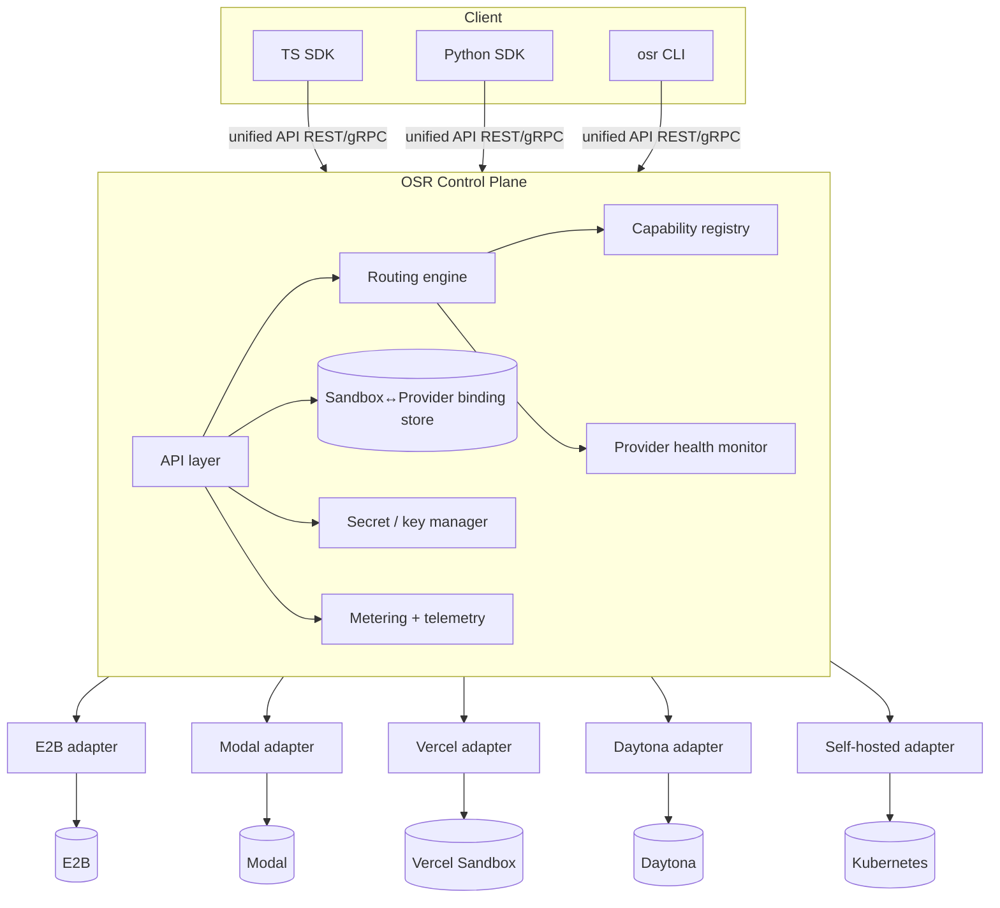

# Open Sandbox Router — Product & Technical Spec

> A unified, provider-agnostic control plane for code-execution **sandboxes**. One API
> and SDK that intelligently provisions and operates ephemeral compute across E2B, Modal,
> Daytona, Vercel Sandbox, Runloop, Fly.io Sprites, and self-hosted runtimes.

Status: **Draft v0.1** · Working name: `open-sandbox-router` (pkg/CLI: `osr`)

---

## 1. Motivation

AI agents increasingly need to run untrusted, model-generated code: data analysis,
web browsing, coding agents, CI-style tasks, tool execution. A fast-growing market
of "sandbox" providers has emerged to serve this — E2B, Modal, Daytona, Vercel
Sandbox, Runloop, Fly.io Sprites, and more — each with isolated microVM/container
runtimes.

But the tooling is fragmented in ways that create real pain:

- **Fragmented, incompatible APIs.** Every provider has its own SDK, resource model,
  image/template format, and lifecycle semantics. Switching providers is a rewrite.
- **No portability.** A workload built on Daytona can't fail over to E2B when Daytona
  has an outage — or when Daytona takes its core closed-source (as it did in June 2026).
- **Opaque, non-comparable economics.** Vercel bills active-CPU; E2B bills session
  time; Modal bills per-second provisioned. Picking the cheapest option per workload
  is impossible without a normalization layer.
- **Capability mismatch.** Providers differ sharply — snapshots, pause/resume, GPU,
  persistent filesystems, exposed ports, region pinning. Teams over-commit to one
  vendor to get one feature.
- **No intelligent placement.** Cold-start latency (90ms–2s), region, price, and
  reliability vary per provider and per moment. There's no routing layer that picks
  the best target per request.

**Open Sandbox Router (OSR)** is an OSS abstraction + intelligent routing layer that
makes sandboxes a commodity you can address through one interface, with automatic
failover, cost/latency-aware placement, and capability negotiation.

---

## 2. Design implications: sandboxes are stateful

The defining property of a sandbox — and the thing that shapes OSR's entire architecture
— is that it is a **long-lived, stateful resource**, not an independent request. Its
properties:

- **Stateful & long-lived.** A sandbox holds a filesystem, running processes, and open
  ports across many operations over its lifetime.
- **Bound to its home provider.** Once created on a provider, every subsequent operation
  (`exec`, filesystem, ports) must be dispatched to that same provider. There is no
  re-routing an existing sandbox.
- **Capabilities diverge sharply.** Snapshots, pause/resume, GPU, persistent disk,
  exposed ports, isolation tech — support varies widely across providers.
- **Economics are per-provider.** Active-CPU, session-time, and per-second-provisioned
  models are not directly comparable without normalization.
- **The latency that matters is cold-start + exec round-trip**, which varies 90ms–2s by
  provider, region, and moment.

The three consequences that shape everything below:

1. **Routing is a create-time decision.** OSR maintains a durable `sandbox → provider`
   binding. Once chosen, the provider is fixed for that sandbox's life (unless migrated).
2. **Capability negotiation is first-class.** `create` requests declare required
   capabilities; the router filters the candidate set before scoring.
3. **Failover splits into two regimes.** Create-time failover is cheap and always on.
   Mid-session failover requires snapshot + restore (a portable migration primitive)
   and is best-effort/opt-in.

---

## 3. Product Spec

### 3.1 Vision

> Make ephemeral compute a commodity. Write against one sandbox API; let OSR place
> each workload on the best provider by cost, latency, capability, and availability —
> and fail over automatically when one goes down.

### 3.2 Positioning

- **For developers building agents & AI apps** who need code execution but don't want
  to marry a single vendor.
- **For platform teams** who want cost control, multi-region placement, and a single
  audit/observability surface across providers.
- **Against** single-provider SDKs (lock-in) and hand-rolled abstraction layers
  (undifferentiated heavy lifting, no routing intelligence).

### 3.3 Target users / personas

1. **Agent framework author** — wants a stable execution backend that "just works"
   across providers, so their users can BYO provider.
2. **AI product engineer** — runs untrusted model output; wants failover + the cheapest
   compliant sandbox per task without vendor research.
3. **Platform / infra lead** — wants BYOK, policy controls (allowed providers, regions,
   spend caps), unified metering, and audit logs.
4. **OSS self-hoster** — runs the gateway on their own infra, points it at their own
   provider accounts.

### 3.4 Core value propositions

- **One API, many providers** — normalized create/exec/fs/lifecycle across all backends.
- **Intelligent routing** — cost/latency/region/reliability-aware placement per policy.
- **Automatic failover** — create-time failover always on; snapshot-based migration
  for live workloads.
- **Capability negotiation** — request `{ gpu, snapshot, ports, minMemory }`; router
  guarantees a compliant target or a typed error.
- **Portable templates** — one Dockerfile-based image spec, built/registered per provider.
- **Unified economics & observability** — normalized cost estimates, metering, tracing,
  and audit across all providers.
- **Not a proxy tax** — self-hostable, BYOK, transparent overhead budget (<50ms for
  control-plane ops that don't touch the provider's data path).

### 3.5 Non-goals (v1)

- Building our own sandbox runtime/hypervisor. (We orchestrate providers; a self-hosted
  Firecracker/gVisor adapter is a *provider*, not the core.)
- Being in the hot data path for exec I/O by default (see §5.7 — direct-connect mode).
- General workload orchestration (queues, cron, DAGs). OSR provisions and operates
  sandboxes; higher-level orchestration lives above it.
- Replacing provider dashboards/billing. We normalize and estimate; providers remain
  source of truth for their invoices.

### 3.6 Representative use cases

- **Code interpreter for an agent** — `create` a Python sandbox, run stateful REPL cells,
  read back stdout/plots/files.
- **Coding agent workspace** — long-lived sandbox with a repo, background dev server on
  an exposed port, multi-step edits.
- **Batch/fan-out execution** — spin up N short-lived sandboxes across cheapest providers,
  respecting a spend cap.
- **Region-pinned execution** — EU-only placement for data residency.
- **Resilient long task** — a multi-hour job that migrates via snapshot if its home
  provider degrades.

### 3.7 Competitive & provider landscape (as of mid-2026)

| Provider | Isolation | Cold start | Persistence | Snapshots | GPU | Pricing model |
|---|---|---|---|---|---|---|
| E2B | Firecracker microVM | ~150ms | ≤24h session | limited | via templates | session time; $150/mo Pro; BYOC |
| Daytona | Firecracker | <90ms | yes | yes | yes | usage; **core closed-source 6/2026** |
| Modal | gVisor | ~100ms | yes | yes | **strong** | per-second provisioned |
| Vercel Sandbox | microVM | — | ephemeral | — | — | **active-CPU** $0.128/vCPU-hr + provisioned mem |
| Runloop | — | — | yes | **yes (checkpoints)** | — | usage; enterprise (audit, SOC2) |
| Fly.io Sprites | persistent VM | 1–2s | **multi-day** | ~300ms restore | — | VM time |
| Self-hosted (Kubernetes) | Firecracker/gVisor/Kata/runc | 10–150ms | your infra | your infra | your infra | your cost |

Market gaps OSR targets: isolation-vs-cost tradeoff opacity, weak stateful-workflow
portability, no cross-provider economics, and single-vendor capability lock-in.

### 3.8 Product principles

1. **Provider-neutral by construction.** No first-party provider is privileged.
2. **Typed capabilities over silent degradation.** If a capability can't be met, fail
   loud with a structured error — never quietly downgrade isolation or drop a feature.
3. **BYOK first.** OSS users bring their own provider keys; a managed/credits mode is an
   optional layer, not a requirement.
4. **Thin control plane.** Stay out of the data path unless asked; keep overhead honest
   and measured.
5. **Escape hatches everywhere.** Provider-specific passthrough params and a "pin to
   provider" mode so power users are never boxed in.

### 3.9 Roadmap

**MVP (v0.1) — "unify + place"**
- Normalized API: `create`, `get`, `list`, `destroy`, `exec` (command, streamed),
  `runCode` (stateful interpreter session), filesystem read/write/list/upload/download.
- Adapters: E2B, Modal, Vercel Sandbox, + one self-hosted (Kubernetes) reference adapter.
- Capability manifest per provider; capability-filtered routing.
- Routing policies: `order`, `cost`, `latency`, `region`, weighted; create-time failover.
- Durable sandbox→provider binding (Postgres). BYOK secret handling.
- TS + Python SDKs; CLI; OpenAPI spec; self-hosted gateway (container image + Helm chart).
- Basic metering + OpenTelemetry traces.

**v1 — "operate + optimize"**
- Portable template/image builder (Dockerfile → per-provider image), template registry.
- Pause/resume + snapshot primitives where supported; exposed ports / preview URLs.
- Normalized cost estimator + spend caps + budgets; usage export.
- More adapters: Daytona, Runloop, Fly.io Sprites, Cloudflare/other.
- Direct-connect mode (SDK talks straight to provider after handshake) to remove OSR
  from the exec data path.
- Policy engine: allowed providers/regions, isolation floor, data-residency rules.

**Future**
- Snapshot-based **live migration** / mid-session failover.
- Auto policy ("pick the best provider for me") with learned latency/price models.
- Hosted OSR (managed keys, credits, single invoice) — commercial layer atop OSS core.
- Marketplace of community templates; warm-pool pre-warming for sub-50ms create.
- Provider-agnostic MCP server exposing OSR to any agent runtime.

### 3.10 OSS & business model

- **License:** Apache-2.0 core (permissive → framework adoption).
- **Open core:** gateway, adapters, SDKs, routing engine, self-host all OSS.
- **Commercial (optional):** hosted control plane with managed keys/credits, SSO/RBAC,
  SLA, advanced policy/audit, warm pools. No core capability is paywalled.

---

## 4. Technical Spec — Architecture

### 4.1 High-level



**Deployment modes:**
1. **Gateway (hosted/self-hosted service)** — clients hit OSR; OSR calls providers.
   Central policy, metering, audit. Default.
2. **Library/embedded** — adapters + router imported directly into the app; no network
   hop; binding store is a local/embedded DB. Good for single-app, low-latency.
3. **Direct-connect (v1)** — gateway does routing + handshake, then hands the SDK a
   scoped provider credential/URL so exec I/O flows client→provider directly, keeping
   OSR out of the hot path while retaining central placement/metering.

### 4.2 Core resource model

```
Sandbox
  id            osr-scoped stable id (independent of provider id)
  provider      resolved home provider (immutable post-create, unless migrated)
  providerRef   provider-native id
  status        provisioning | running | paused | stopped | terminated | error
  template      resolved image/template ref
  resources     { vcpu, memoryMB, diskMB, gpu? }
  region        resolved region
  capabilities  granted capability set
  ttl / expiresAt
  ports         [{ port, url, protocol }]
  metadata      user tags
  createdAt / lastActiveAt
```

Operations (normalized verbs):
- **Lifecycle:** `create`, `get`, `list`, `destroy`, `pause`, `resume`, `extendTtl`,
  `snapshot`, `restore`.
- **Execution:** `exec(cmd, {stream, env, cwd, timeout})` → streamed stdout/stderr/exit;
  `runCode(session, code, {language})` → stateful interpreter (REPL) with rich results
  (stdout, results, artifacts, errors).
- **Process:** `startProcess` (background) / `listProcesses` / `kill` / `attach`.
- **Filesystem:** `read`, `write`, `list`, `mkdir`, `remove`, `move`, `upload`,
  `download`, `watch`.
- **Network:** `exposePort(port)` → preview URL; `listPorts`.

### 4.3 Unified API (illustrative)

REST (gRPC mirror for streaming-heavy ops). All bodies JSON; streams via SSE/websocket.

```http
POST /v1/sandboxes
{
  "template": "python-3.12-datascience",
  "resources": { "vcpu": 2, "memoryMB": 2048 },
  "ttlSeconds": 3600,
  "requiredCapabilities": ["filesystem", "runCode"],
  "preferredCapabilities": ["snapshot"],
  "routing": {
    "strategy": "cost",
    "order": ["vercel", "modal", "e2b"],
    "allow": ["vercel", "modal", "e2b", "self-hosted"],
    "region": "us-*",
    "isolationFloor": "microvm",
    "maxCostPerHourUsd": 0.50,
    "allowFallbacks": true
  },
  "providerOptions": { "e2b": { "template": "custom-xyz" } }
}
→ 201 { "id": "sbx_abc", "provider": "vercel", "status": "running",
        "capabilities": [...], "region": "us-east", "expiresAt": "..." }
```

```http
POST /v1/sandboxes/sbx_abc/exec
{ "cmd": "python analyze.py", "stream": true, "timeoutSeconds": 120 }
→ text/event-stream: {stdout}… {stderr}… {exit: 0}

POST /v1/sandboxes/sbx_abc/fs/write   { "path": "/work/analyze.py", "content": "..." }
GET  /v1/sandboxes/sbx_abc/fs/read?path=/work/out.csv
POST /v1/sandboxes/sbx_abc/ports      { "port": 3000 } → { "url": "https://...preview" }
POST /v1/sandboxes/sbx_abc/snapshot   → { "snapshotId": "snap_..." }
DELETE /v1/sandboxes/sbx_abc
```

**SDK ergonomics (TS):**

```ts
import { OSR } from "@osr/sdk";
const osr = new OSR({ baseUrl, apiKey });        // or embedded: new OSR({ mode: "library" })

const sbx = await osr.sandboxes.create({
  template: "python-3.12-datascience",
  required: ["runCode", "filesystem"],
  routing: { strategy: "latency", region: "eu-*", isolationFloor: "microvm" },
});

await sbx.fs.write("/work/data.csv", csv);
const res = await sbx.runCode("import pandas as pd; pd.read_csv('/work/data.csv').describe()");
console.log(res.stdout, res.results);           // rich results incl. artifacts
const { url } = await sbx.exposePort(8501);
await sbx.destroy();
```

Provider identity is deliberately visible (`sbx.provider`) but never required to use
the API. Provider-specific power features are reachable via `providerOptions` passthrough
and typed `sbx.raw()` escape hatch.

### 4.4 Provider adapter interface

Every provider implements a normalized contract. Adapters are the only provider-aware
code; the router and API layer stay generic.

```ts
interface SandboxAdapter {
  readonly id: string;                         // "e2b" | "modal" | ...
  capabilities(): CapabilityManifest;          // static + dynamically probed
  estimateCost(spec: SandboxSpec): CostEstimate;
  health(): Promise<HealthStatus>;             // feeds router's outage avoidance

  create(spec: NormalizedSpec, creds: ProviderCreds): Promise<ProviderSandbox>;
  get(ref: string): Promise<ProviderSandbox>;
  destroy(ref: string): Promise<void>;

  exec(ref: string, req: ExecRequest): AsyncIterable<ExecEvent>;
  runCode?(ref: string, req: CodeRequest): AsyncIterable<CodeEvent>;
  fs: FsOps;                                    // read/write/list/upload/download/watch
  exposePort?(ref: string, port: number): Promise<PortInfo>;

  pause?(ref: string): Promise<void>;
  resume?(ref: string): Promise<void>;
  snapshot?(ref: string): Promise<SnapshotRef>;
  restore?(snap: SnapshotRef, spec: NormalizedSpec): Promise<ProviderSandbox>;

  // Portable templates
  buildTemplate?(spec: TemplateSpec): Promise<ProviderTemplateRef>;
}
```

Optional methods (`snapshot`, `pause`, `runCode`, `exposePort`) reflect real capability
gaps. Their presence/absence populates the capability manifest, which the router uses to
filter candidates. Adapters translate errors into a **normalized error taxonomy**
(`CapacityError`, `RateLimited`, `AuthError`, `CapabilityUnsupported`, `Timeout`,
`ProviderDown`) so routing/failover logic is provider-independent.

### 4.5 Capability model

The heart of correct multi-provider behavior. A `CapabilityManifest` per provider:

```ts
interface CapabilityManifest {
  provider: string;
  isolation: "microvm" | "gvisor" | "container";
  runtimes: string[];                 // languages/templates supported
  features: {
    filesystem: boolean; runCode: boolean; exec: boolean;
    exposePorts: boolean; pauseResume: boolean; snapshot: boolean;
    persistentDisk: boolean; gpu: boolean; customImage: boolean;
  };
  limits: { maxVcpu; maxMemoryMB; maxDiskMB; maxTtlSeconds; maxConcurrent };
  regions: string[];
  coldStartMsP50: number;             // observed, updated by telemetry
  costModel: CostModel;               // active-cpu | session | per-second-provisioned
}
```

**Create-time negotiation:**
1. Parse `requiredCapabilities` + implicit needs (e.g. `isolationFloor: microvm`,
   `resources.gpu`, `region`).
2. Filter providers whose manifest satisfies *all* requireds → candidate set.
3. If empty → `422 NoCompliantProvider` with the unmet constraint (never silently
   downgrade — principle 2).
4. `preferredCapabilities` become scoring bonuses, not filters.

### 4.6 Routing engine

Runs **only at `create`**. Pipeline: **filter → score → order → attempt with failover.**

**Scoring** (weighted, policy-configurable — the router's jobs are provider selection,
load balancing, and failover, adapted for stateful compute):

```
score(provider) =
    w_cost      * normalizedCost(spec)          // via estimateCost + costModel
  + w_latency   * coldStartScore(provider,region)
  + w_region    * regionMatch(provider, req.region)
  + w_reliab    * reliabilityScore(provider)    // health monitor + recent error rate
  + w_capability* preferredCapabilityBonus
  + w_pref      * explicitOrderBonus            // req.routing.order
  - penalties(outage<30s, rate-limited, over budget)
```

Built-in strategies (sugar over weights):
- `order` — strict user priority list, first compliant + healthy wins.
- `cost` — cheapest compliant provider (inverse-price weighting).
- `latency` — lowest expected cold-start for the region.
- `balanced` (default) — blended.
- `pin:<provider>` — bypass routing (power users / reproducibility).

**Guardrails:** `allow`/`deny` provider lists, `region` globs, `isolationFloor`,
`maxCostPerHourUsd` / budget checks, per-tenant policy from the policy engine.

**Health & outage avoidance:** a background monitor + circuit breakers deprioritize
providers with recent failures/outages (e.g. deprioritize any provider with an outage in
the last 30s), capacity errors, or rate-limit signals.

**Create-time failover:** try candidates in scored order; on `CapacityError`/
`ProviderDown`/`Timeout`, transparently attempt the next until success or list
exhausted → `503 AllProvidersFailed` with per-attempt detail. `allowFallbacks: false`
disables this.

### 4.7 State management & session affinity

Because sandboxes are stateful, OSR keeps a **durable binding**:

```
binding: osrSandboxId → { provider, providerRef, region, capabilities,
                          creds ref, status, expiresAt, tenant }
```

- Backed by **Postgres** (gateway) or embedded store (library mode); optional Redis
  cache for hot lookups.
- Every non-`create` op resolves the binding and dispatches to the *same* provider.
  There is no re-routing of an existing sandbox.
- A **reaper** enforces TTLs and reconciles orphaned provider resources (cost safety).
- **Idempotency keys** on `create` prevent duplicate provisioning on client retries.
- Binding is the audit anchor: every op is attributable to a tenant, provider, and cost.

### 4.8 Failover & migration

Two regimes:

1. **Create-time failover** (MVP, always available) — cheap; no state exists yet (§4.6).
2. **Mid-session migration** (v1+, opt-in, best-effort) — when a running sandbox's home
   provider degrades:
   - Only possible if both source and target support `snapshot`/`restore` (capability
     gated) *or* the workload declared itself stateless/reconstructable.
   - Flow: `snapshot(source)` → transfer artifact → `restore(target)` → rebind →
     resume client. Filesystem-only state can use a portable tar export/import fallback.
   - Exposed as `sbx.migrate({ to?, reason })` and as an automatic policy
     (`onProviderDegraded: "migrate" | "fail"`). Live in-memory process state is **not**
     guaranteed across heterogeneous providers — documented explicitly.

### 4.9 Portable templates / images

Biggest portability pain after the API itself. OSR defines a **portable template spec**:

```yaml
# osr.template.yaml
name: python-3.12-datascience
base: python:3.12-slim          # OCI base
setup:
  - pip install pandas numpy matplotlib
env: { PYTHONUNBUFFERED: "1" }
workdir: /work
expose: [8501]
```

- `osr template build` compiles this to each provider's native format (E2B template,
  Modal image, Vercel/Fly image, OCI for self-hosted) and registers refs in a
  **template registry** keyed by content hash.
- `create` resolves `template` → per-provider ref for the routed provider; if a provider
  lacks a built image, the router either builds on demand or excludes it (policy).
- Enables true portability: same declared environment, any provider.

### 4.10 Networking & preview URLs

- `exposePort` normalizes provider preview/tunnel URLs (E2B/Modal/Vercel/Fly differ).
  Returns a stable OSR URL that proxies (gateway mode) or the provider URL directly
  (direct-connect). Auth/token handling normalized.
- Egress policy (allow/deny lists, no-network mode) expressed as capability + policy
  where the provider supports it.

### 4.11 Observability, metering & cost

- **Metering:** every op records provider, duration, active-CPU/mem where available,
  producing a **normalized usage record**. A pluggable **cost normalizer** maps each
  provider's model (active-CPU vs session vs per-second-provisioned) to a comparable
  `$ estimate` for routing and reporting. Provider invoices remain source of truth;
  OSR reconciles estimates against them where APIs allow.
- **Tracing:** OpenTelemetry spans across API → router → adapter → provider; every
  sandbox op is traceable end-to-end.
- **Audit log:** immutable per-tenant record (who created what, where, cost, policy
  decisions) — a key differentiator vs raw provider SDKs.
- **Dashboards:** placement decisions, failover events, per-provider cost/latency/error
  rates, spend vs budget.

### 4.12 Auth, secrets & multi-tenancy

- **BYOK:** tenants register provider credentials; stored encrypted (KMS/`age`/sealed
  secrets), referenced by binding, never logged. Adapters receive scoped creds per call.
- **OSR keys:** clients authenticate to the gateway with OSR API keys (per-tenant,
  scoped, rate-limited).
- **Managed/credits mode (optional, hosted):** OSR holds provider accounts, meters
  usage against credits. Strictly optional atop the OSS core.
- **Policy engine:** per-tenant allowed providers/regions, isolation floor, spend caps,
  data-residency rules — enforced in the routing filter and at op time.

### 4.13 Data model (gateway)

```
tenants(id, name, plan, policy_json)
osr_api_keys(id, tenant_id, hash, scopes, rate_limit)
provider_credentials(id, tenant_id, provider, enc_secret, meta)
providers(id, manifest_json, health_json, updated_at)     # capability + live health
templates(id, name, content_hash, spec_yaml)
template_builds(id, template_id, provider, provider_ref, status)
sandboxes(id, tenant_id, provider, provider_ref, status, template_id,
          resources_json, region, capabilities_json, ports_json,
          expires_at, created_at, last_active_at, idem_key)
usage_records(id, sandbox_id, op, provider, started_at, duration_ms,
              active_cpu_ms, mem_mb, est_cost_usd)
audit_log(id, tenant_id, actor, action, sandbox_id, decision_json, ts)
```

### 4.14 Security

- Untrusted-code execution is the whole point → **isolation floor** is a policy, and the
  router never places below it. Default surface is the provider's; self-hosted adapter
  must document its isolation (Firecracker > gVisor > container).
- Secrets never cross into sandboxes unless explicitly injected; no provider creds in
  sandbox env.
- Egress controls, port-exposure auth, per-tenant network isolation where supported.
- Supply-chain: signed template builds, content-hash pinning, SBOM for the gateway.
- Tenant isolation in the control plane; scoped creds; full audit trail.

### 4.15 Recommended tech stack

- **Core / adapters:** TypeScript (Node) for gateway + first-class TS SDK; Python SDK as
  a thin client over the same REST/gRPC contract (matches where agents live). Adapter
  interface language-agnostic via OpenAPI + gRPC proto.
- **Transport:** REST + SSE for simple ops; gRPC/websocket for streamed exec.
- **State:** Postgres (bindings, metering, audit) + Redis (health cache, rate limits).
- **Telemetry:** OpenTelemetry + Prometheus.
- **Packaging:** OCI container image + Helm chart for Kubernetes; embeddable npm/pypi library.
- **Contract-first:** OpenAPI + proto as the source of truth; SDKs generated + hand-tuned.

### 4.16 Overhead budget

- Control-plane ops (create decision, binding lookup): target **<50ms** added latency.
- Data-path ops (exec/fs) in gateway mode: minimize buffering; offer **direct-connect**
  (v1) to remove OSR from the hot path entirely (client ↔ provider after handshake).

---

## 5. Key risks & open questions

1. **Divergent capabilities may limit true portability.** Mitigation: capability model
   + honest typed errors; don't over-promise seamless failover for live state.
2. **Mid-session migration is genuinely hard** across heterogeneous isolation tech.
   Scope MVP to create-time failover; treat migration as best-effort filesystem-state
   portability first.
3. **Cost normalization is approximate** (active-CPU vs session vs provisioned). Position
   as *estimate for routing + reporting*, reconcile against provider billing where APIs
   exist; never present as an invoice.
4. **Adapter maintenance burden** as provider APIs churn (e.g. Modal's filesystem API
   deprecation, Daytona going closed-source). Mitigation: thin adapters, contract tests
   per provider, community-owned adapters, capability probing to catch drift.
5. **Not-in-the-hot-path vs central control** tension. Resolve with direct-connect mode.
6. **Bootstrapping adoption.** Land with the 3–4 highest-usage providers + an MCP server
   + drop-in shims for popular agent frameworks so switching is a one-line change.

---

## 6. Success metrics

- **Adoption:** GitHub stars, SDK installs, # providers with community adapters.
- **Portability proof:** median time to switch a workload's provider (target: config-only).
- **Reliability:** failover success rate; reduction in user-visible sandbox failures vs
  single-provider baseline.
- **Economics:** average cost delta vs naive single-provider placement.
- **Overhead:** p50/p95 control-plane added latency.

---

## Sources

- E2B: [fast.io sandbox roundup](https://fast.io/resources/best-code-execution-sandboxes-ai-agents/), [agdex review](https://agdex.ai/tools/e2b)
- Modal: [Sandbox docs](https://modal.com/docs/reference/modal.Sandbox), [running commands](https://modal.com/docs/guide/sandbox-spawn), [filesystem](https://modal.com/docs/guide/sandbox-files), [best sandboxes 2026](https://modal.com/resources/best-code-execution-sandboxes-coding-agents)
- Vercel Sandbox: [Northflank pricing comparison](https://northflank.com/blog/ai-sandbox-pricing), [aiidelist review](https://aiidelist.com/ide/vercel-sandbox)
- Daytona: [daytona.io](https://www.daytona.io/), [GitHub](https://github.com/daytonaio/daytona), [Blaxel roundup](https://blaxel.ai/blog/code-execution-sandboxes-for-ai-agents)
- Landscape: [The Code Execution Sandbox Race 2026 — AgentMarketCap](https://agentmarketcap.ai/blog/2026/04/11/code-execution-sandbox-race-2026), [Spheron guide](https://www.spheron.network/blog/ai-agent-code-execution-sandbox-e2b-daytona-firecracker/)
